<div style="position: absolute; top: 0; right: 0;">
    <a href="ertugrulbusiness@gmail.com"></a>
    <a href="https://tr.linkedin.com/in/ertu%C4%9Fruldemir?original_referer=https%3A%2F%2Fwww.google.com%2F"></a>
    <a href="https://github.com/ertugruldmr"></a>
    <a href="https://www.kaggle.com/erturuldemir"></a>
    <a href="https://huggingface.co/ErtugrulDemir"></a>
    <a href="https://stackoverflow.com/users/21569249/ertu%c4%9frul-demir?tab=profile"></a>
    <a href="https://medium.com/@ertugrulbusiness"></a>
    <a href="https://www.youtube.com/channel/UCB0_UTu-zbIsoRBHgpsrlsA"></a>
</div>

# Traffic Density Regression
 
## __Table Of Content__
- (A) [__Brief__](#brief)
  - [__Project__](#project)
  - [__Data__](#data)
  - [__Demo__](#demo) -> [Live Demo](https://ertugruldemir-trafficdensityforecasting.hf.space)
  - [__Study__](#problemgoal-and-solving-approach) -> [Colab](https://colab.research.google.com/drive/1LP5I769qBfre9pqb7D9hLt8TJjoukaIg)
  - [__Results__](#results)
- (B) [__Detailed__](#Details)
  - [__Abstract__](#abstract)
  - [__Explanation of the study__](#explanation-of-the-study)
    - [__(A) Dependencies__](#a-dependencies)
    - [__(B) Dataset__](#b-dataset)
    - [__(C) Pre-processing__](#c-pre-processing)
    - [__(D) Exploratory Data Analysis__](#d-exploratory-data-analysis)
    - [__(E) Modelling__](#e-modelling)
    - [__(F) Saving the project__](#f-saving-the-project)
    - [__(G) Deployment as web demo app__](#g-deployment-as-web-demo-app)
  - [__Licance__](#license)
  - [__Connection Links__](#connection-links)

## __Brief__ 

### __Project__ 
- This is a __Time Series Regression__ project that uses the  [Traffic Prediction Dataset](https://www.kaggle.com/datasets/fedesoriano/traffic-prediction-dataset?datasetId=1169027&sortBy=voteCount) to __predict the traffic densiy__.
- The __goal__ is build a model that accurately __predict the traffic densiy__  based on the features. 
- The performance of the model is evaluated using several __metrics__ such as_RMSE_.

#### __Overview__
- This project involves building a machine learning model to predict the vehicle counts on number of 2 features. 1 feature is numerical (Vehicle Count) and 1 feature is categorical (Junction). The dataset contains 48120 records. The models selected according to model tuning results, the progress optimized respectively the previous tune results. The project uses Python and several popular libraries such as Pandas, NumPy, Scikit-learn, Prophet time series library.

#### __Demo__

<div align="left">
  <table>
    <tr>
    <td>
        <a target="_blank" href="https://ertugruldemir-trafficdensityforecasting.hf.space" height="30">[Demo app] HF Space</a>
      </td>
      <td>
        <a target="_blank" href="https://colab.research.google.com/drive/1abgeihq6j3oNIFjRdySjBYVJlHd_0jGM">[Demo app] Run in Colab</a>
      </td>
      <td>
        <a target="_blank" href="https://github.com/ertugruldmr/TrafficDensityRegression/blob/main/study.ipynb">[Traning pipeline] source on GitHub</a>
      </td>
    <td>
        <a target="_blank" href="https://colab.research.google.com/drive/1LP5I769qBfre9pqb7D9hLt8TJjoukaIg">[Traning pipeline] Run in Colab</a>
      </td>
    </tr>
  </table>
</div>


- Description
    - __predict the traffic densiy__  based on features.
    - __Usage__: Set the feature values through sliding the radio buttons then use the button to predict.
- Embedded [Demo](https://ertugruldemir-trafficdensityforecasting.hf.space) window from HuggingFace Space
    

<iframe
	src="https://ertugruldemir-trafficdensityforecasting.hf.space"
	frameborder="0"
	width="850"
	height="450"
></iframe>

#### __Data__
- The [Traffic Prediction Dataset](https://www.kaggle.com/datasets/fedesoriano/traffic-prediction-dataset?datasetId=1169027&sortBy=voteCount) from kaggle platform.
- The dataset contains 2 features, 1 categorical and 1 numerical.
- The dataset contains the following features:


<table>
<tr><th>Data Info </th><th><div style="padding-left: 50px;">Stats</div></th></tr>
<tr><td>

| Column    | Non-Null Count | Dtype  |
| --------- | -------------- | ------ |
| DateTime  | 48120          | object |
| Junction  | 48120          | int64  |
| Vehicles  | 48120          | int64  |
| ID        | 48120          | int64  |


</td><td>

<div style="flex: 50%; padding-left: 50px;">

| models    | count   | mean      | std       | min   | 25%   | 50%   | 75%   | max   |
|-----------|---------|-----------|-----------|-------|-------|-------|-------|-------|
| Junction  | 48120.0 | 2.180549  | 0.966955  | 1.0   | 1.00  | 2.0   | 3.00  | 4.0   |
| Vehicles  | 48120.0 | 22.791334 | 20.750063 | 1.0   | 9.00  | 15.0  | 29.00 | 180.0 |
| Year      | 48120.0 | 2016.2698 | 0.616093  | 2015.0| 2016.0| 2016.0| 2017.0| 2017.0|
| Month     | 48120.0 | 5.884289  | 3.569872  | 1.0   | 3.00  | 5.0   | 9.00  | 12.0  |
| Date_no   | 48120.0 | 15.700748 | 8.784073  | 1.0   | 8.00  | 16.0  | 23.00 | 31.0  |
| Hour      | 48120.0 | 11.500000 | 6.922258  | 0.0   | 5.75  | 11.5  | 17.25 | 23.0  |


</div>

</td></tr> </table>


<div style="text-align: center;">
    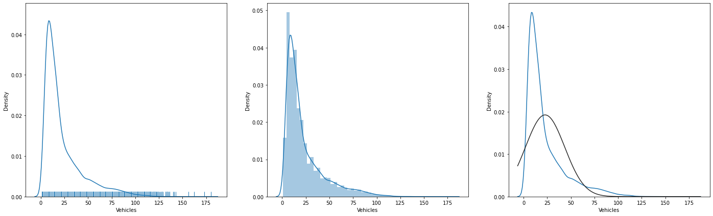
    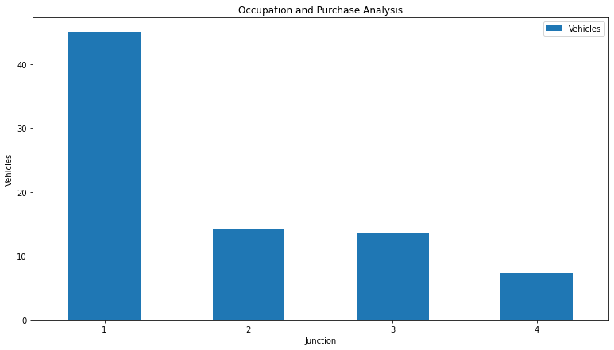
    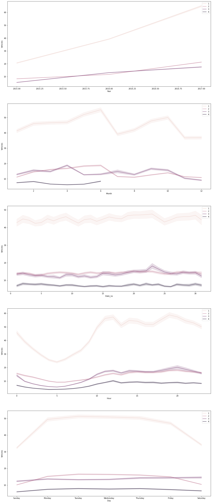
</div>


#### Problem, Goal and Solving approach
- This is a __time series regression__ problem  that uses the  [Traffic Prediction Dataset](https://www.kaggle.com/datasets/fedesoriano/traffic-prediction-dataset?datasetId=1169027&sortBy=voteCount)  from kaggle to __predict the traffic densiys__ based on 2 features which are 1 categorical and 1 numerical.
- The __goal__ is to build a model that accurately __predict the traffic densiy__ based on the features.
- __Solving approach__ is that using the supervised machine learning models (linear, non-linear, ensemly).

#### Study
The project aimed predict the house prices using the features. The study includes following chapters.
- __(A) Dependencies__: Installations and imports of the libraries.
- __(B) Dataset__: Downloading and loading the dataset.
- __(C) Pre-processing__: It includes data type casting, missing value handling, outlier handling.
- __(D) Exploratory Data Analysis__: Univariate, Bivariate, Multivariate anaylsises. Correlation and other relations. 
- __(E) Modelling__: Model tuning via GridSearch on Linear, Non-linear, Ensemble Models.  
- __(F) Saving the project__: Saving the project and demo studies.
- __(G) Deployment as web demo app__: Creating Gradio Web app to Demostrate the project.Then Serving the demo via huggingface as live.

#### results
- The final models are trained on __prophet__ library because of the results when comparet with our custom deep learning architecture.


- GRU deep learning model
  <div style="text-align: center;">
      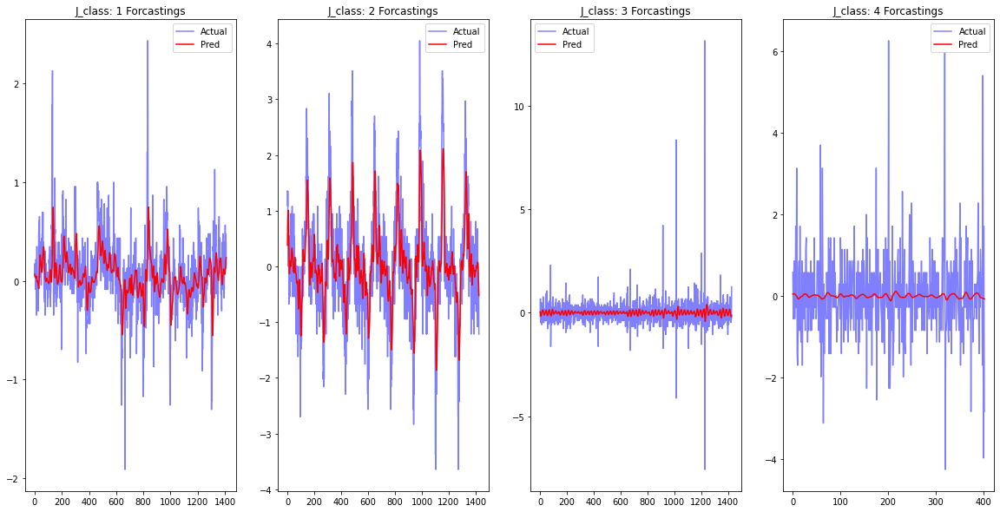
  </div>

- Prophet model (a model per class of the junction categorical feature)
  <div style="text-align: center;">
      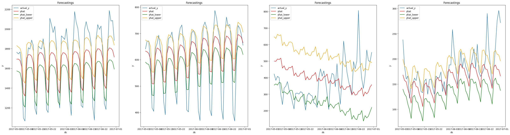
  </div>
  <div style="text-align: center;">
      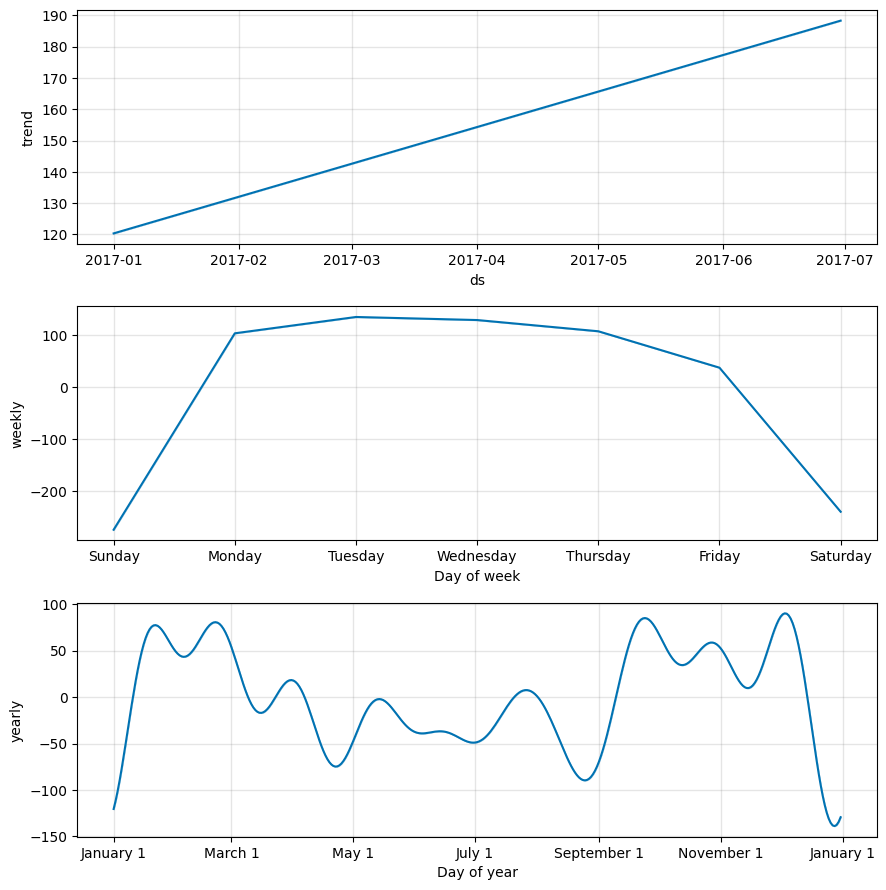
      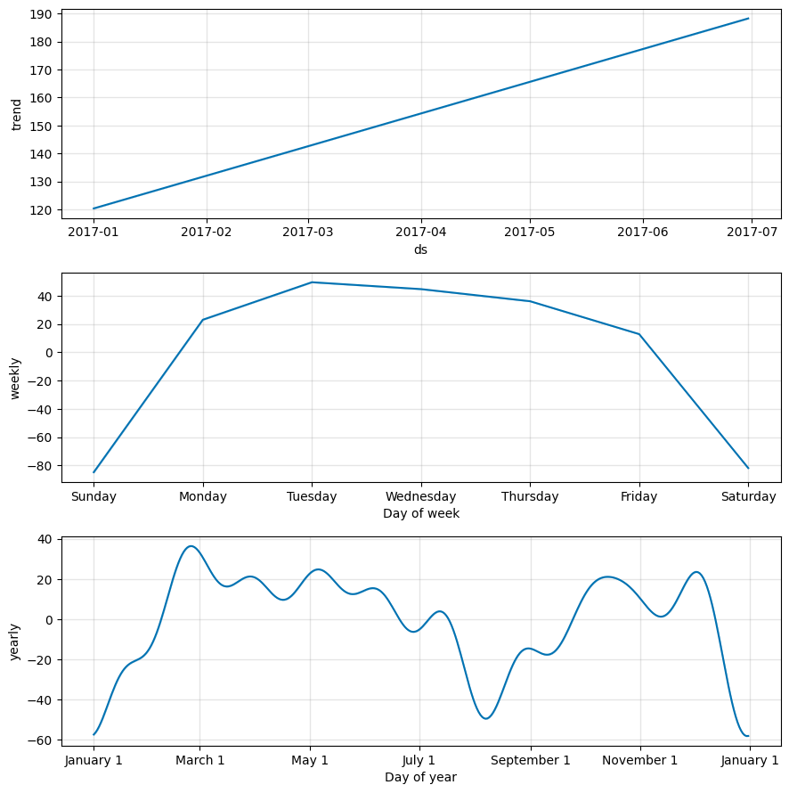
      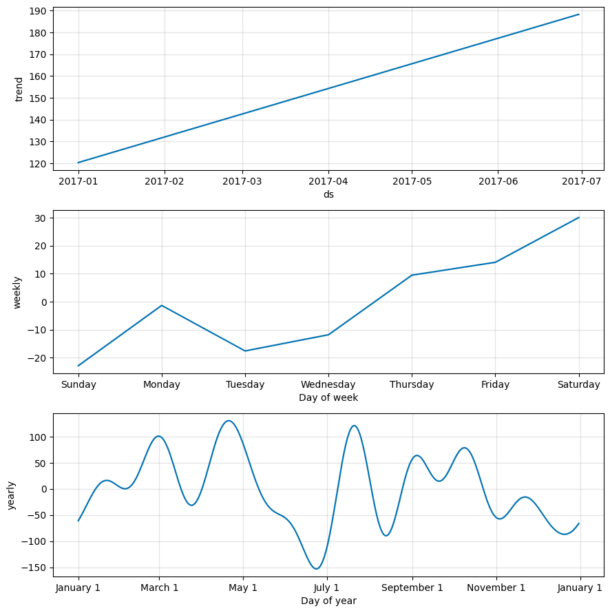
      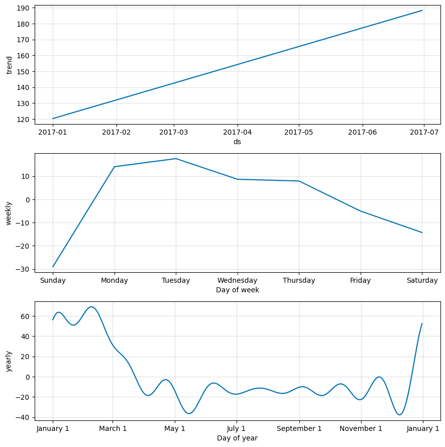
  </div>


## Details

### Abstract
- [Traffic Prediction Dataset](https://www.kaggle.com/datasets/fedesoriano/traffic-prediction-dataset?datasetId=1169027&sortBy=voteCount) is used to predict the vehicle count on the traffic. The dataset has 48120 records, 2 features which are 1 categorical and 1 numerical typed. The problem is supervised learning task as regression. The goal is predicting  traffic density  correctly through using supervised machine learning algorithms such as time seris, prophet model and deep learning models.The study includes creating the environment, getting the data, preprocessing the data, exploring the data, modelling the data, saving the results, deployment as demo app. The data splitted 4 pieces because of the categorical data impact then the data aggregated by periods as hour, month, year. Training phase of the models implemented through prophet model tuning and deep learning training approachs.  Regression results collected and compared between the models. Selected the basic and more succesful model.  Created a demo at the demo app section and served on huggingface space.  


### File Structures

- File Structure Tree
```bash
├── demo_app
│   ├── app.py
│   ├── requirements.txt
│   ├── tf_Junction_0.sav
│   ├── tf_Junction_1.sav
│   ├── tf_Junction_2.sav
│   └── tf_Junction_3.sav
├── docs
│   └── images
├── env
│   ├── env_installation.md
│   └── requirements.txt
├── LICENSE
├── readme.md
└── study.ipynb
```
- Description of the files
  - demo_app/
    - Includes the demo web app files, it has the all the requirements in the folder so it can serve on anywhere.
  - demo_app/tf_Junction_n.sav:
    - The trained (Model Tuned) model as pickle (python object saving) format per class of 'junction' categorical feature.
  - demo_app/requirements.txt
    - It includes the dependencies of the demo_app.
  - docs/
    - Includes the documents about results and presentations
  - env/
    - It includes the training environmet related files. these are required when you run the study.ipynb file.
  - LICENSE.txt
    - It is the pure apache 2.0 licence. It isn't edited.
  - readme.md
    - It includes all the explanations about the project
  - study.ipynb
    - It is all the studies about solving the problem which reason of the dataset existance.    


### Explanation of the Study
#### __(A) Dependencies__:
  -  There is a third-parth installation which is kaggle dataset api, just follow the study codes it will be handled. The libraries which already installed on the environment are enough. You can create an environment via env/requirements.txt. Create a virtual environment then use hte following code. It is enough to satisfy the requirements for runing the study.ipynb which training pipeline.
#### __(B) Dataset__: 
  - Downloading the [Traffic Prediction Dataset](https://www.kaggle.com/datasets/fedesoriano/traffic-prediction-dataset?datasetId=1169027&sortBy=voteCount)  via kaggle dataset api from kaggle platform. The dataset has 48120 records. There are 2 features which are 81 categorical and 1 numerical typed. For more info such as histograms and etc... you can look the '(D) Exploratory Data Analysis' chapter.
#### __(C) Pre-processing__: 
  - The processes are below:
    - Preparing the dtypes such as casting the object type to categorical type.
    - Feature engineering: Stationary process implemented respectly the statistical stationary test. Then the data splitted according the class of the 'junction' categorical data to create indicidual time series model. After the creating new dataset via splitting, parsing the vehicle counst 6 periods such as week, month, year etc....
    - Missing value processes: Analyzed the data  but there was no missing values.
    - Outlier analysis processes: uses  both visual and IQR calculation apporachs. According to IQR approach, detected statistically significant outliers are handled using boundary value casting assignment method.
      <div style="text-align: center;">
          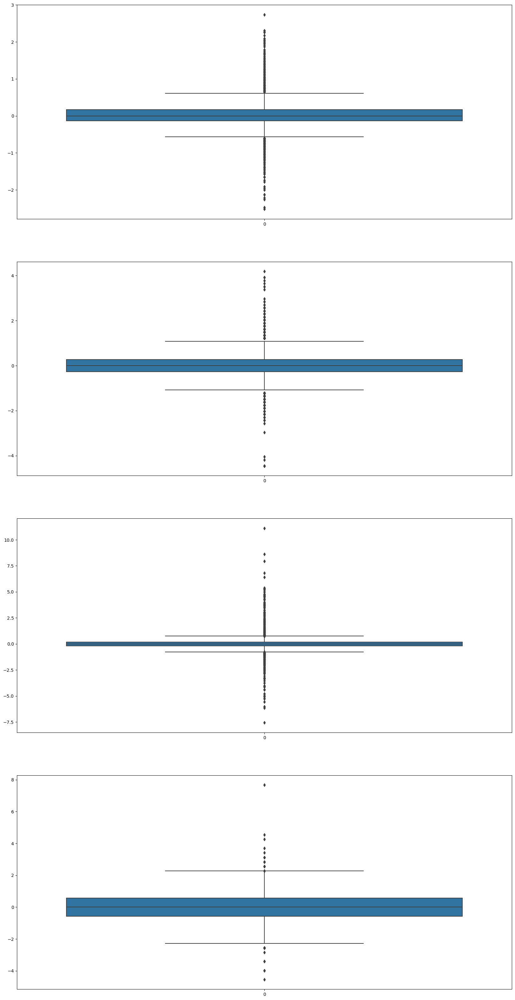
      </div>
 
#### __(D) Exploratory Data Analysis__:
  - Dataset Stats
<table>
<tr><th>Data Info </th><th><div style="padding-left: 50px;">Stats</div></th></tr>
<tr><td>

| Column    | Non-Null Count | Dtype  |
| --------- | -------------- | ------ |
| DateTime  | 48120          | object |
| Junction  | 48120          | int64  |
| Vehicles  | 48120          | int64  |
| ID        | 48120          | int64  |


</td><td>

<div style="flex: 50%; padding-left: 50px;">

| models    | count   | mean      | std       | min   | 25%   | 50%   | 75%   | max   |
|-----------|---------|-----------|-----------|-------|-------|-------|-------|-------|
| Junction  | 48120.0 | 2.180549  | 0.966955  | 1.0   | 1.00  | 2.0   | 3.00  | 4.0   |
| Vehicles  | 48120.0 | 22.791334 | 20.750063 | 1.0   | 9.00  | 15.0  | 29.00 | 180.0 |
| Year      | 48120.0 | 2016.2698 | 0.616093  | 2015.0| 2016.0| 2016.0| 2017.0| 2017.0|
| Month     | 48120.0 | 5.884289  | 3.569872  | 1.0   | 3.00  | 5.0   | 9.00  | 12.0  |
| Date_no   | 48120.0 | 15.700748 | 8.784073  | 1.0   | 8.00  | 16.0  | 23.00 | 31.0  |
| Hour      | 48120.0 | 11.500000 | 6.922258  | 0.0   | 5.75  | 11.5  | 17.25 | 23.0  |


</div>

</td></tr> </table>

  - Variable Analysis
    - Univariate analysis, 
      <div style="text-align: center;">
      
      
      
      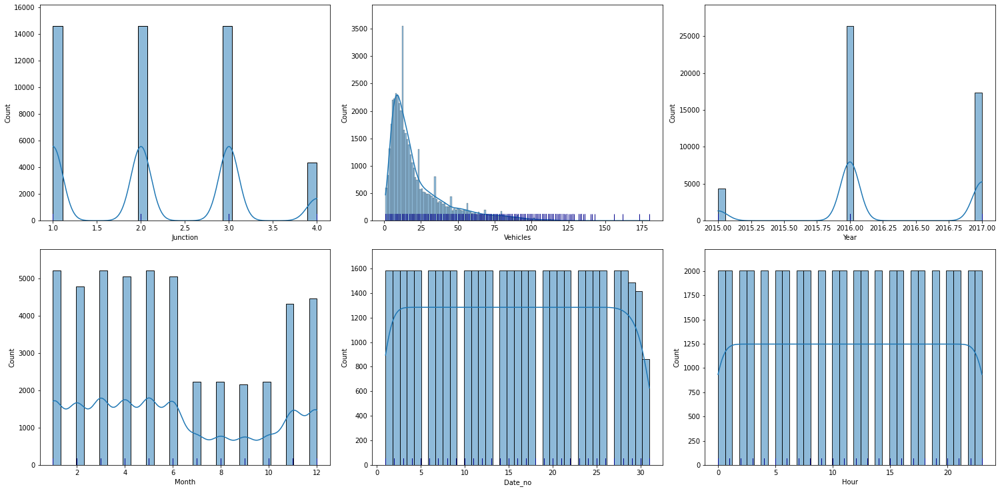
      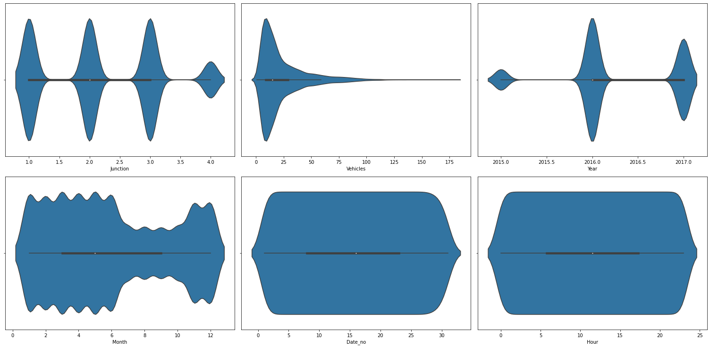
      </div>
    - Bivariate analysis
      <div style="text-align: center;">
          
      </div>
    - Multivariate analysis.
      <div style="text-align: center;">
          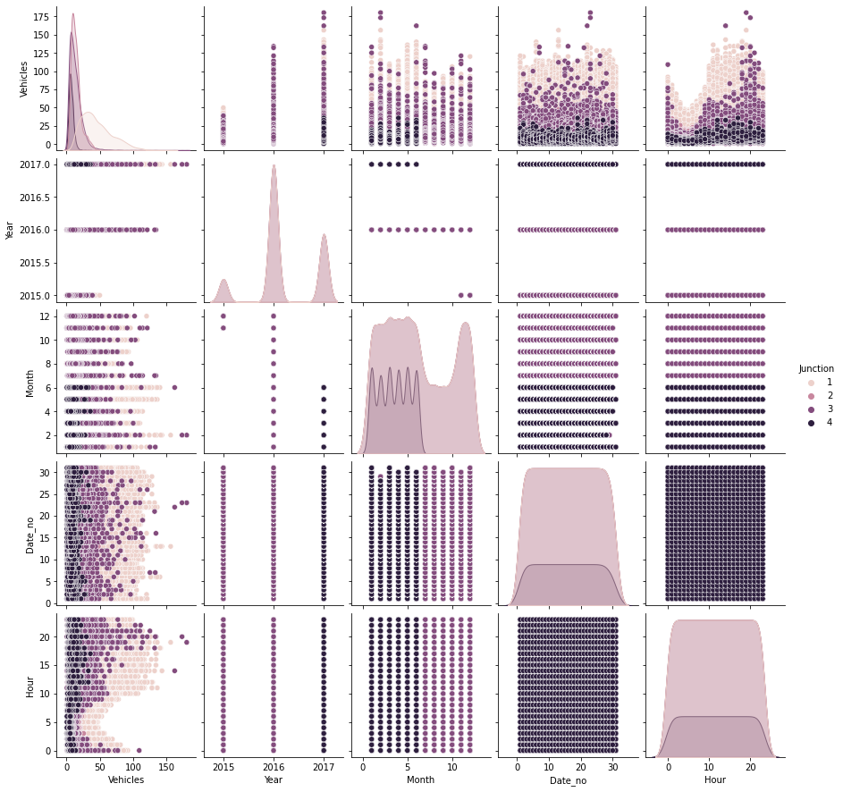 
      </div>
  - Other relations.
    <div style="display:flex; justify-content: center; align-items:center;">
      <div style="text-align: center;">
      <figure>
      <p>Correlation</p>
      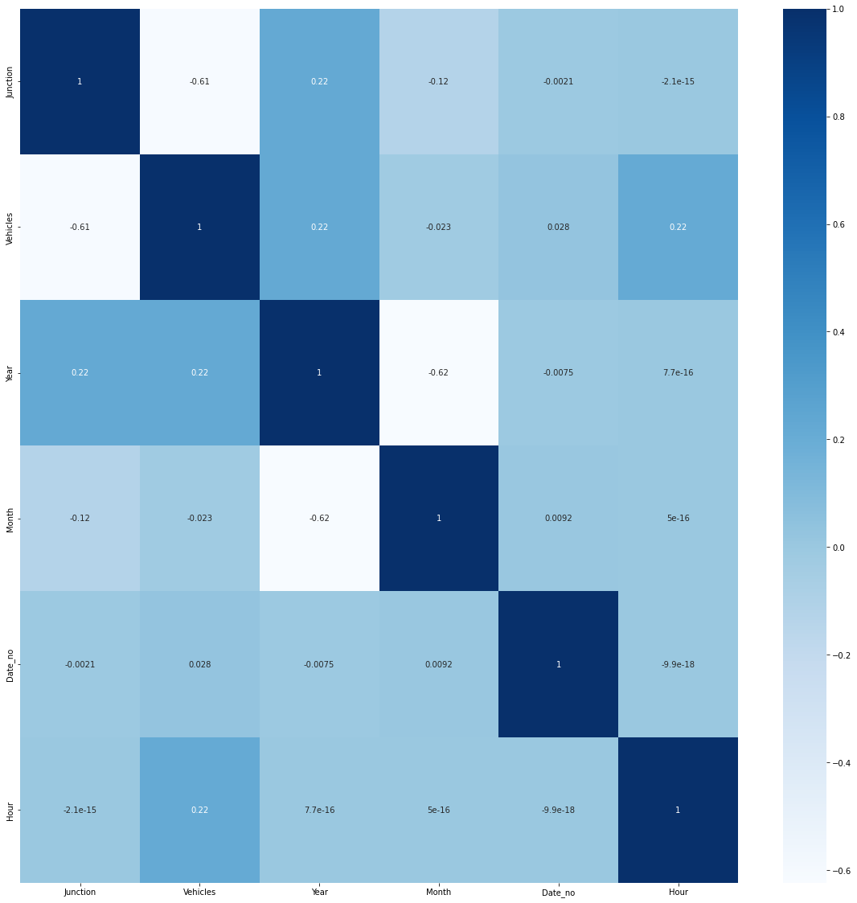
      </figure>
      </div>
       <div style="text-align: center;">
      <figure>
      <p>Correlation between target</p>
      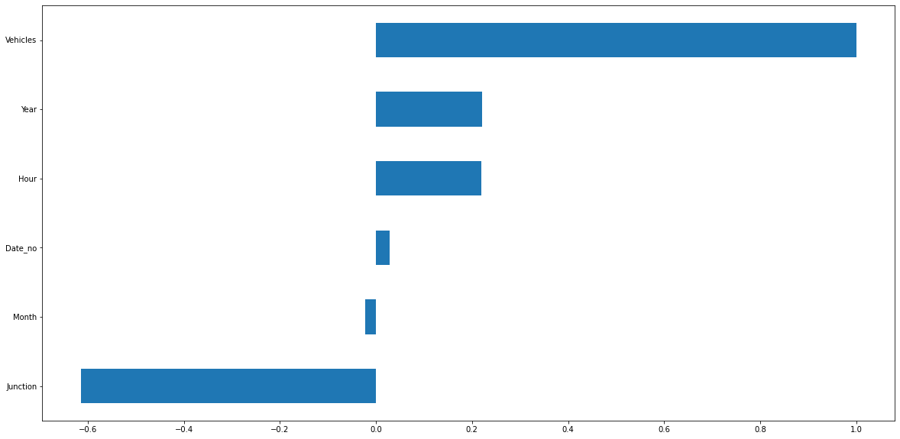
      </figure>
      </div>
      <div style="text-align: center;">
      <figure>
      <p>Variance</p>
      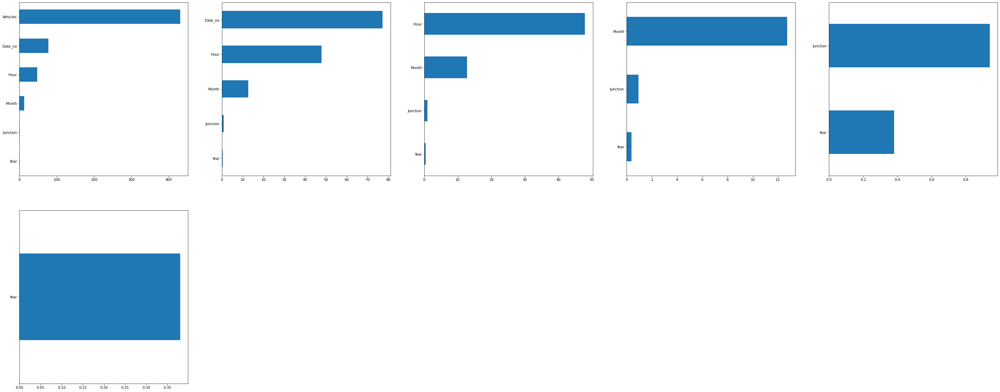
      </figure>
      </div>
      <div style="text-align: center;">
      <figure>
      <p>Covariance</p>
      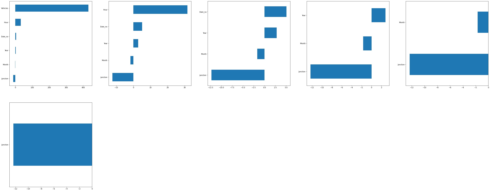
      </figure>
      </div>
    </div>

#### __(E) Modelling__: 
  - Data Split
    - First split implemented through creating new pieces according to classes of the 'junction' categorical variable.
    - Time series periods setted as hours, months, years.
    - Finally the last 60 day took as test data.
  - Trains
    - Custom Deep learning model
      - Used Basic GRU model to forcest next 30 days.
    - Prophet library
      - Used for training a time seris model via giving the vehicle counts.
  - Custom GRU deep learning model results

- GRU deep learning model
  <div style="text-align: center;">
      
  </div>

- Prophet model (a model per class of the junction categorical feature)
  <div style="text-align: center;">
      
  </div>
  <div style="text-align: center;">
      
      
      
      
  </div>


#### __(F) Saving the project__: 
  - Saving the project and demo studies.
    - trained model __tf_junction.sav__ as pickle format.
#### __(G) Deployment as web demo app__: 
  - Creating Gradio Web app to Demostrate the project.Then Serving the demo via huggingface as live.
  - Desciption
    - Project goal is predicting the sales price based on four features.
    - Usage: Set the feature values through sliding the radio buttons and dropdown menu then use the button to predict.
  - Demo
    - The demo app in the demo_app folder as an individual project. All the requirements and dependencies are in there. You can run it anywhere if you install the requirements.txt.
    - You can find the live demo as huggingface space in this [demo link](https://ertugruldemir-trafficdensityforecasting.hf.space) as full web page or you can also us the [embedded demo widget](#demo)  in this document.  
    
## License
- This project is licensed under the Apache 2.0 License. See the [LICENSE](LICENSE) file for details.

<h1 style="text-align: center;">Connection Links</h1>

<div style="text-align: center;">
    <a href="ertugrulbusiness@gmail.com"></a>
    <a href="https://tr.linkedin.com/in/ertu%C4%9Fruldemir?original_referer=https%3A%2F%2Fwww.google.com%2F"></a>
    <a href="https://github.com/ertugruldmr"></a>
    <a href="https://www.kaggle.com/erturuldemir"></a>
    <a href="https://huggingface.co/ErtugrulDemir"></a>
    <a href="https://stackoverflow.com/users/21569249/ertu%c4%9frul-demir?tab=profile"></a>
    <a href="https://www.hackerrank.com/ertugrulbusiness"></a>
    <a href="https://app.patika.dev/ertugruldmr"></a>
    <a href="https://medium.com/@ertugrulbusiness"></a>
    <a href="https://www.youtube.com/channel/UCB0_UTu-zbIsoRBHgpsrlsA"></a>
</div>

